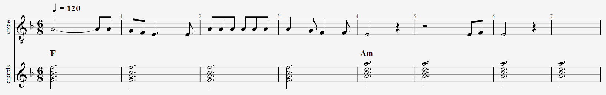
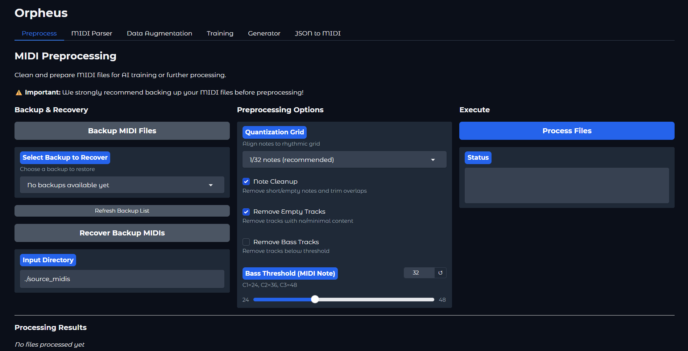
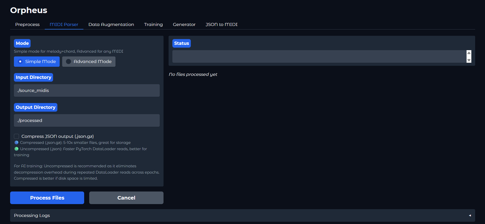
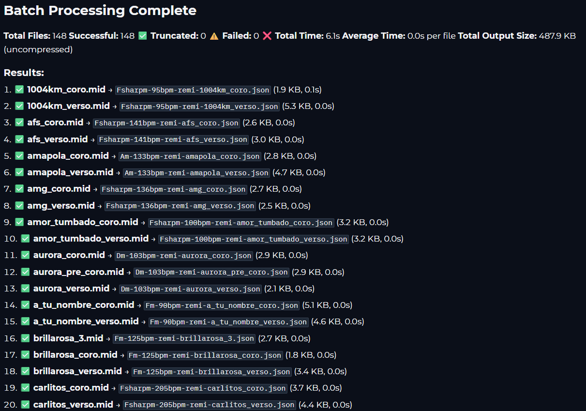
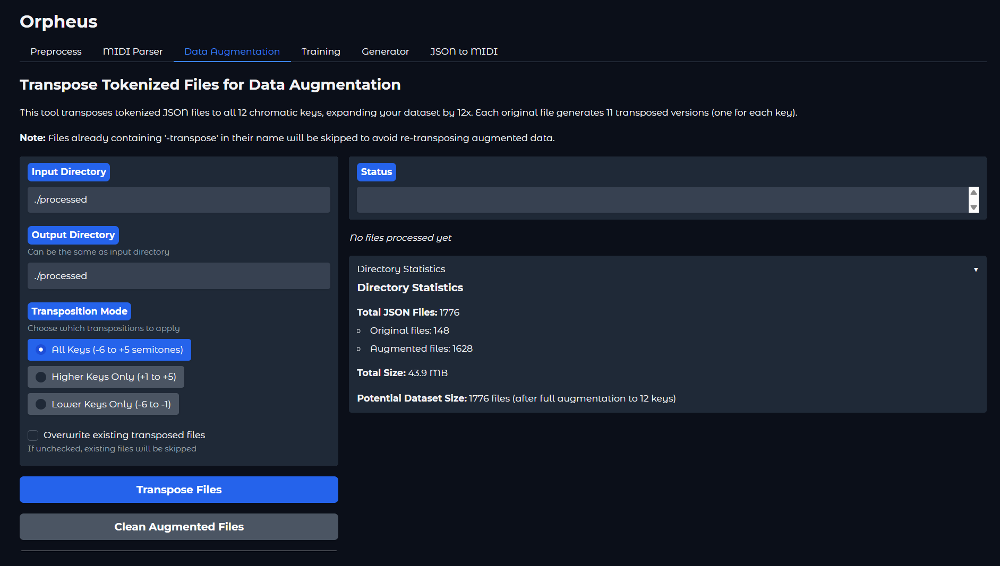
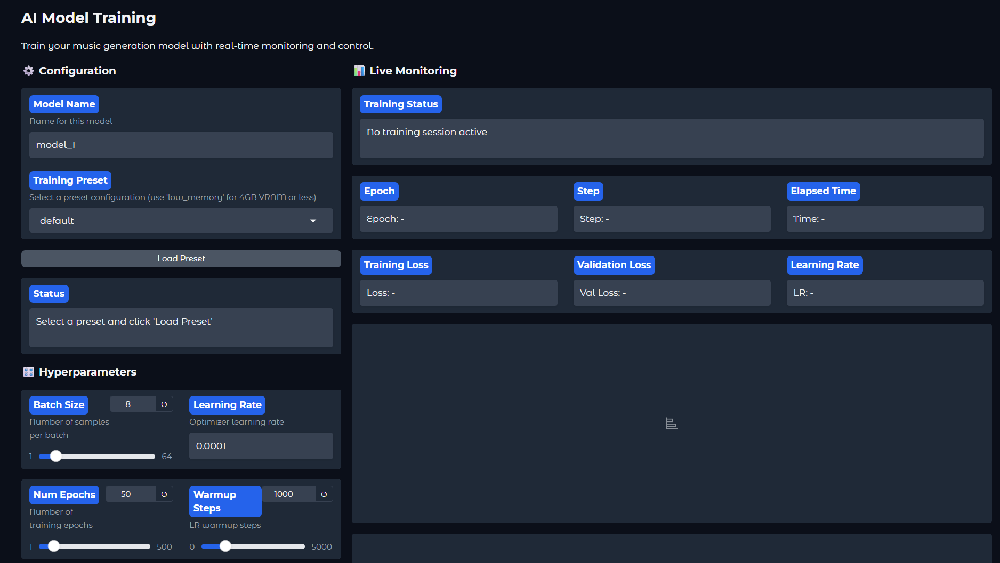
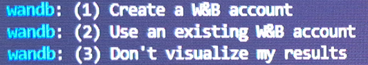
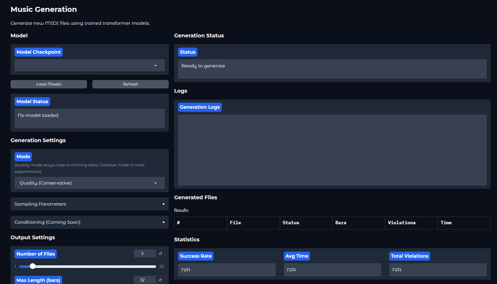
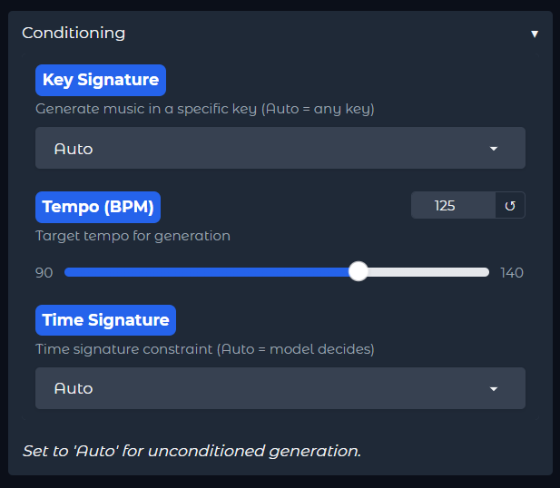
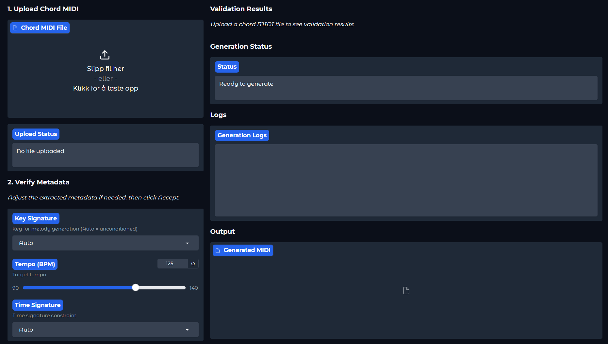

# Orpheus

<p align="center">
  
</p>

A basic songwriter AI, aimed at producing MIDI files with melody tracks and chord (harmony) tracks, intended to be used as a simple songwriting tool for musicians, producers, and (of course) songwriters.

This AI is supposed to take MIDI files in their most basic structure, being a monophonic melody track and a chord track with no rhythmic variation, with **each chord being repeated each bar** to ensure the chord context survives the tokenization process. For proper function of the AI, your training files will have to look something like this:



This structure will make sure the AI learns the basic structure of songs (chords and melody), allowing it to train on the core aspects parts of your song dataset, after this, you can manually add more production (chord rhythmic variations, more instruments, bass, etc) to the generated files. But this structure allows the AI to learn on the fundamental aspects of each song.

### How does the AI Identify Tracks In My Dataset?

The AI uses a 3-layered system to automatically identify melody and chord tracks:

1. **Track Name Recognition**: Detects keywords like "melody", "lead", "solo", "voice" for melodies, and "chord", "accomp", "harmony", "pad" for chords (supports multiple languages)

2. **Polyphony Analysis**:
   - **Melody tracks**: Monophonic or light polyphony (≤2 notes playing simultaneously)
   - **Chord tracks**: High polyphony (≥3 notes playing simultaneously)

3. **Instrument Analysis**: Uses MIDI program numbers and channel information

The system uses all three methods for accurate classification. This means you can name your tracks in your preferred language, or let the project analyze the musical content automatically.

### Note Range and Constraints

- **Bass Track Removal**: Tracks with more than 35% of notes below C2 (MIDI note 36) should be manually removed during preprocessing.
- **Training Pitch Range**: C2 to C6 (MIDI notes 36-84) - optimized for vocal and guitar/piano melodies
- This range covers most melodic and harmonic content while filtering out bass-heavy material.

## Installation

### Prerequisites

Ensure you have Python 3.10 or newer installed. Verify your version:

```bash
python -V
```

**Note**: This project was developed with Python 3.10.8, though all newer versions should be compatible.

### Repository Setup

Clone the repository using Git (recommended):

```bash
git clone https://github.com/AlanElPlatano/Orpheus.git
```

Alternatively, you can download the ZIP archive from the GitHub repo.

### Virtual Environment Configuration

Create an isolated Python environment (strongly recommended):

```bash
python -m venv my_venv
```

Replace `my_venv` with your preferred environment name. This creates a dedicated folder in your project root.

Activate the environment:

```bash
{name_of_your_venv}/Scripts/Activate.ps1
```

A `(my_venv)` prefix in your terminal (or whatever name you chose) confirms successful activation.

---

### PyTorch Installation

PyTorch requires a specific installation depending on your hardware configuration.

#### NVIDIA GPU (Best)

For systems with NVIDIA GPUs with CUDA support:

```bash
pip install torch torchvision torchaudio --index-url https://download.pytorch.org/whl/cu118
```

This installs PyTorch with CUDA 11.8 support for GPU acceleration.  
**Size**: Approximately 2.8GB so be patient during download.

#### CPU-Only Systems

For AMD GPUs, Intel processors, or systems without dedicated graphics:

```bash
pip install torch torchvision torchaudio --index-url https://download.pytorch.org/whl/cpu
```

**Performance Note**: CPU training is significantly slower but fully functional.

#### Custom CUDA Versions

For different CUDA installations, consult the [PyTorch installation guide](https://pytorch.org/get-started/locally/) for your specific configuration.

### Remaining Dependencies

Install all additional required libraries:

```bash
pip install -r requirements.txt
```

This will install all other required libraries (Gradio, Pretty MIDI, MidiTok, etc.). This may take a few minutes, but this should be a much faster download than PyTorch.

---

## Usage

First, copy all of your source MIDI files into the 'source_midis' folder on the root of the project, here is where the processing will start.

Then, open the gradio GUI by activating the following command (remember to have your virtual environment activated):
```bash
python -m gui.gradio_app
```

After about 10-15 seconds, you will see a message like this one on the console:
```
* Running on local URL:  http://localhost:42069
* To create a public link, set `share=True` in `launch()`.
```

Now you can open any browser and go to 'http://localhost:42069', here you will see the Gradio GUI:



The pre-processing tab prepares your MIDI files for optimal training performance.

### Backup & Recovery

Located in the left column, this backup system allows you to:
- Create backups before modification
- Restore original files if needed
- Experiment with preprocessing parameters risk-free

### Preprocessing Operations

The center column offers several refinement tools:

- **Quantization**: Aligns notes to the grid for rhythmic consistency (recommended)
- **Note Cleanup**: Removes artifacts and corrects common MIDI issues
- **Track Cleanup**: Eliminates empty or redundant tracks
- **Bass Filtering**: Removes tracks where >35% of notes fall below the threshold

On the right we have the Process button and a status log for additional clarity. The processed files will overwrite the original ones, hence why the backup function is provided.

---

### Then, we have the MIDI Parser tab:



Our AI cannot understand MIDI files because they're binary files, so this tab processes them into a JSON format which the AI can understand.

On the bottom of the page we get the basic buttons to start the process and cancel it. When you finish parsing, you will see a log on screen like this one:



**Note:** The parser has a limit of 2048 tokens per file so very long files will be truncated to fit within this limit. If you get any truncated files i **strongly** recommend to import that file into any MIDI editor and split it into several smaller files to make sure all your dataset gets used for training and nothing gets discarded.

---

### Up next, we have the Augmentation tab:



This tab is very important because it performs transposition to improve model generalization and perform data augmentation.

### Transposition Strategy

The system creates 12 versions of each song by transposing from -6 to +5 semitones, maintaining modal integrity (major stays major, minor stays minor).

### Why we're dping this

**1. Scale-Invariant Learning**  
The model learns intrinsic musical patterns independent of key, preventing bias toward keys overrepresented in your original dataset.

**2. Dataset Expansion**  
Multiplies your training dataset by 12×, providing substantially more learning material while maintaining stylistic coherence.

**3. Overfitting Prevention**  
The augmentation system ensures all 12 transpositions of each song remain together in the same split (training/validation/test), preventing data leakage and artificial performance inflation.

---

### The Training Tab



Here is one of the most important tabs in our project, here we will train our models and will be where we will spend most of our time.

First, on the top of the left column we get a model name field, as the name suggests this name will be used to name our model, you can leave the default name or use a custom name.

### Training Presets

- **Default**  
Balanced training run with standard quality. Good for general use case.

- **Quick Test** 
Single-epoch validation run to verify your pipeline integrity before committing to longer training sessions.

- **Overfit** *(Diagnostic)*  
Deliberately memorizes a small batch. While overfitting is typically undesirable, successful memorization confirms your training pipeline functions correctly. Very useful for debugging and sanity checks.

- **production:**
High-end preset, it will make a long training process with all features maxxed out BUT IT WILL CONSUME AN UNGODLY AMOUNT OF VRAM, make sure you have a GPU with +16GB of VRAM before using this preset.

- **low_memory:**
This preset exists solely to replace the 'default' and 'production' presets for low memory systems like laptops (~4GB VRAM). Keep in mind that this preset will use a shorter context window and will most likely truncate training data.

You can select a preset by opening the drop down menu and clicking 'Load Preset', this will replace all the options with the ones from the preset. Once you have everything ready, you can scroll down and click 'Start Training' which will start the process.

**Important Note:** When you start a training for the first time you will be prompted to optionally log in to 'Weights and Biases' (wandb):



Which is a simple web-based database that the project uses to submit statistics of all your training runs. I used it because i moved a lot between computers while working on the project so keeping track of training runs without having to manually transfer log files was very useful.

You can type "3" and "Enter" if you don't need it.

Unless you selected 'quick_test' this will start a process that will take several hours to finish, for reference, my RTX 3060 12GB took about 8 hours with the production preset and 2000 files.

#### Pause and Resume During Training

If you need to briefly pause training (for example, to free up the GPU for another task), use the **⏸️ Pause** button. This will temporarily halt training while keeping everything in memory. Click **▶️ Resume** to continue from where you left off.

**Important:** The Pause/Resume feature only works within the current session. If you click **🛑 Stop** or close the GUI, you'll need to resume from a checkpoint

### Checkpoint System

Because this process is very long, i have implemented a checkpoint system:


During training, checkpoints are automatically saved **every 2000 steps** (or every 50 steps for quick_test, 1000 for overfit). The system keeps the 5 most recent checkpoints and automatically deletes older ones to save disk space. Each checkpoint contains your model's current state, optimizer settings, and training progress, you can find each checkpoint in pytorch/checkpoints with a subfolder for every model you've trained.

In this menu you can find several options, first we have a "Select Checkpoint" menu that lists all the current checkpoints, you can select one from the list and then click "Load Checkpoint", it doesn't show up on the list you can try the "Refresh List" button. Below it you can find a status windows along with another window that lists all the checkpoints in a non-interactive list, along with its own List and Refresh buttons.

Once you finish training, we can move to the next tab.

---

### The Generator tab



This is the tab where we will generate our files with the models we've trained. On the top left you can select from all the models you have, all the checkpoints created from the last model you trained will also show up here.

We also get generation settings, where we can choose between three modes:

- **Quality (Conservative)**: Uses Temperature 0.8, Top-p 0.95, Repetition Penalty 1.1. Stays close to training data for predictable, safe outputs.
- **Creative (Experimental)**: Uses Temperature 1.1, Top-p 0.92, Repetition Penalty 1.05. Produces more varied, experimental outputs with higher randomness.
- **Custom**: Allows you to manually adjust the sampling parameters to your preference.

Below it we get options for conditional generation:



Here we can apply constraints to the generated files using a model, all settings are optional so you can use any combination of them and the model will be able to generate files following these guides.

**NOTE: Be aware that these guidelines are learned during training, this means that they will only work correctly if all your dataset had the correct key and time signature metadata**. If you are using MIDI files without a specified key (which defaults to C Major) the model will not have learned what keys mean and will most likely generated faulty data when constraints are applied. 

And at the bottom we get some output options, where we can define the number of generated files and max length. Right below these options we get the 'Generate Music', which will use the model to generate the files, this process should only take a few minutes depending on how many files you are generating, inference is much faster than training.

If everything up to this point went well, you should have your generated MIDI files in the output path. You can import these files into any MIDI software (Reaper, Guitar Pro, Sybellius, Tux Guitar, Pro Tools, etc) and you will have your music. Enjoy!

---

### Custom Chords Tab



This is a very interesting tab as it allows the user to provide existing MIDI files with a chord progression and use a trained model to generate melodies on top of it.

- When you upload a file, some metadata like key, BPM and Time Signature are read for context, this information is given to the user for verification on the Verify section, this will be used as constraints to generate the melody on top of the given chord progression.

- Similarly to the generation tab, we get generation settings and output settings, to further customize the output files

## Contributing
Contributions and bug reports are welcome. Please submit issues and pull requests through the GitHub repository.

Acknowledgments:

Built with PyTorch, Gradio, Pretty MIDI, MidiTok and miditoolkit.

Big shoutout to wandb for allowing me to monitor my training sessions from the gym by logging into their website from my phone to see real time info about the training state of my models.